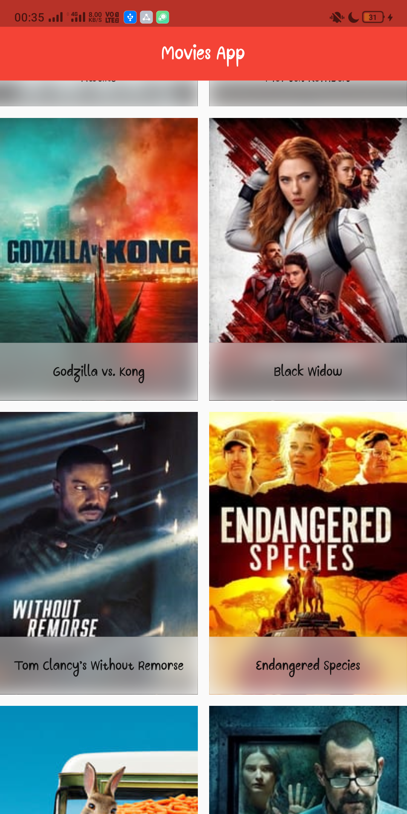

# movie_app 

A new Flutter project based on TMDB API

# Goal:
 - Learning RiverPod
 - Securing API KEY
 - Making http request using Dio

# Getting Started

 - Get your TMDB API key from [TMDB Website](https://www.themoviedb.org/)
 - Create a file called ```.env``` in root directory of this project
 - Put your API key in it as:
 ```
    SECRET_API_KEY=YOUR_API_KEY_HERE
 ```
 - You are ready to run the app now.


# Thanks to TMDB for providing this API.
<div class="attribute tmdb">  </div>

# App in action:
<div class="row">
      
           
</div>
